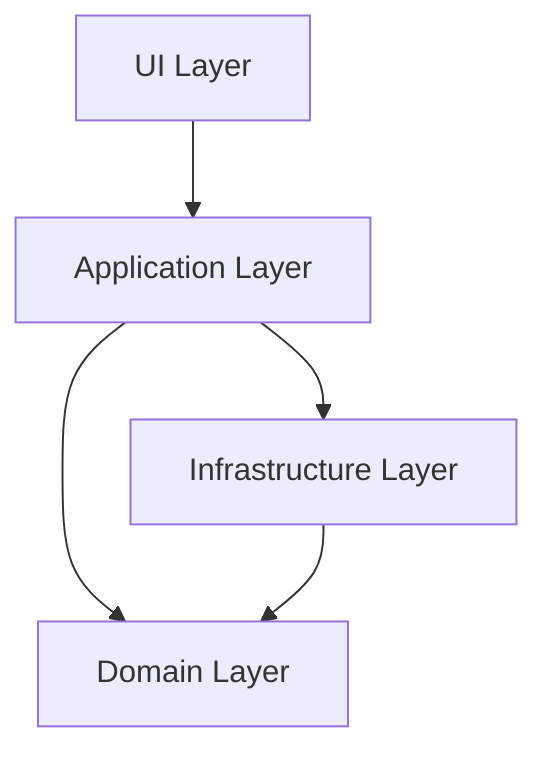

# 웹앱 설계 문서

## 1. 개요

이 문서는  웹앱의 설계를 정의합니다. 이 웹앱은 기본 ...을 제공합니다.

### 1.1 목적

이 웹앱의 주요 목적은 다음과 같습니다:
- 

### 1.2 범위

이 웹앱은 다음 기능을 포함합니다:
- 

## 2. 아키텍처 설계

이 웹앱은 Clean Architecture와 SOLID 원칙을 기반으로 설계됩니다. 이를 통해 코드의 유지보수성, 테스트 용이성, 확장성을 향상시킵니다.

### 2.1 아키텍처 개요



- **UI Layer**: 사용자 인터페이스 컴포넌트 (React 컴포넌트)
- **Application Layer**: 사용자 케이스 구현 (계산 수행, 히스토리 관리 등)
- **Domain Layer**: 핵심 비즈니스 로직과 엔티티 (계산 모델, 수식 표현 등)
- **Infrastructure Layer**: 외부 라이브러리와의 인터페이스 (Math.js 어댑터 등)

### 2.2 Clean Architecture 적용

Clean Architecture에 따라 프로젝트 구조를 다음과 같이 구성합니다:

```
src/
├── entities/           # 핵심 비즈니스 로직과 데이터 모델
├── usecases/           # 애플리케이션 특화 비즈니스 규칙
├── adapters/           # 외부 라이브러리와의 인터페이스
├── frameworks/         # UI 컴포넌트, 상태 관리 등
└── main.tsx            # 앱 진입점
```

### 2.3 SOLID 원칙 적용

- **단일 책임 원칙(SRP)**: 각 컴포넌트와 함수는 하나의 책임만 가집니다.
- **개방-폐쇄 원칙(OCP)**: 새로운 기능을 추가할 때 기존 코드를 수정하지 않고 확장할 수 있도록 설계합니다.
- **리스코프 치환 원칙(LSP)**: 상위 타입의 객체를 하위 타입의 객체로 대체해도 프로그램의 정확성이 유지되도록 합니다.
- **인터페이스 분리 원칙(ISP)**: 클라이언트가 사용하지 않는 인터페이스에 의존하지 않도록 합니다.
- **의존성 역전 원칙(DIP)**: 고수준 모듈이 저수준 모듈에 의존하지 않도록 추상화에 의존합니다.

## 3. 컴포넌트 설계

### 3.1 엔티티 (Entities)

#### 3.1.1 Expression


#### 3.1.2 CalculationResult


#### 3.1.3 


### 3.2 유스케이스 (Usecases)

#### 3.2.1 


#### 3.2.2 ManageHistory


### 3.3 어댑터 (Adapters)

#### 3.3.1 


### 3.4 프레임워크 (Frameworks)

#### 3.4.1 UI 컴포넌트


#### 3.4.2 상태 관리

```typescript
// src/frameworks/state/calculatorContext.tsx
import React, { createContext, useReducer } from 'react';
import { CalculationResult } from '../../entities/CalculationResult';

// 상태 타입 정의
interface CalculatorState {
  expression: string;
  result: string;
  history: CalculationResult[];
  isEngineeringMode: boolean;
  isDarkMode: boolean;
}

// 액션 타입 정의
type CalculatorAction =
  | { type: 'SET_EXPRESSION'; payload: string }
  | { type: 'SET_RESULT'; payload: string }
  | { type: 'ADD_TO_HISTORY'; payload: CalculationResult }
  | { type: 'CLEAR_HISTORY' }
  | { type: 'TOGGLE_MODE' }
  | { type: 'TOGGLE_THEME' };

// 리듀서 함수
const calculatorReducer = (state: CalculatorState, action: CalculatorAction): CalculatorState => {
  // 액션 처리 로직
};

// 컨텍스트 생성
export const CalculatorContext = createContext<{
  state: CalculatorState;
  dispatch: React.Dispatch<CalculatorAction>;
}>({
  state: {
    expression: '',
    result: '',
    history: [],
    isEngineeringMode: false,
    isDarkMode: false,
  },
  dispatch: () => null,
});

// 컨텍스트 프로바이더
export const CalculatorProvider: React.FC = ({ children }) => {
  const [state, dispatch] = useReducer(calculatorReducer, {
    expression: '',
    result: '',
    history: [],
    isEngineeringMode: false,
    isDarkMode: false,
  });

  return (
    <CalculatorContext.Provider value={{ state, dispatch }}>
      {children}
    </CalculatorContext.Provider>
  );
};
```

## 4. 사용자 인터페이스 설계

### 4.1 레이아웃

이 앱은 다음과 같은 레이아웃으로 구성됩니다:

#### 와이어프레임


이 와이어프레임은 다음 구성 요소를 보여줍니다:
- 

### 4.2 테마

다크 모드와 라이트 모드를 지원하며, Chakra UI의 테마 시스템을 활용합니다.

```typescript
// src/frameworks/ui/theme.ts
import { extendTheme } from '@chakra-ui/react';

const theme = extendTheme({
  config: {
    initialColorMode: 'light',
    useSystemColorMode: true,
  },
  colors: {
    // 색상 정의
  },
  components: {
    // 컴포넌트 스타일 정의
  },
});

export default theme;
```

### 4.3 반응형 디자인

Chakra UI의 반응형 유틸리티를 활용하여 다양한 화면 크기에 대응합니다.

```typescript
// 예시: 반응형 버튼 크기
<Button
  size={{ base: 'sm', md: 'md', lg: 'lg' }}
  // 기타 속성
>
  7
</Button>
```

## 5. 테스트 전략

### 5.1 단위 테스트

각 엔티티, 유스케이스, 어댑터에 대한 단위 테스트를 작성합니다.

```typescript
// src/entities/__tests__/Expression.test.ts
import { MathJsExpression } from '../../adapters/MathJsAdapter';

describe('Expression', () => {
  it('should evaluate simple expression correctly', () => {
    const expression = new MathJsExpression('2 + 3');
    expect(expression.evaluate()).toBe(5);
  });

  it('should evaluate complex expression correctly', () => {
    const expression = new MathJsExpression('(3 + 5) * 2 - 4 / 2');
    expect(expression.evaluate()).toBe(14);
  });
});
```

### 5.2 통합 테스트

유스케이스와 어댑터 간의 상호작용을 테스트합니다.

```typescript
// src/usecases/__tests__/CalculateExpression.test.ts
import { CalculateExpressionImpl } from '../CalculateExpressionImpl';
import { MathJsExpression } from '../../adapters/MathJsAdapter';

describe('CalculateExpression', () => {
  it('should calculate expression and return result', () => {
    const calculateExpression = new CalculateExpressionImpl();
    const expression = new MathJsExpression('2 + 3');
    const result = calculateExpression.execute(expression);
    
    expect(result.expression).toBe('2 + 3');
    expect(result.result).toBe(5);
    expect(result.timestamp).toBeInstanceOf(Date);
  });
});
```

### 5.3 UI 테스트

React Testing Library를 사용하여 UI 컴포넌트를 테스트합니다.

```typescript
// src/frameworks/ui/components/__tests__/Calculator.test.tsx
import { render, screen, fireEvent } from '@testing-library/react';
import { Calculator } from '../Calculator';
import { CalculatorProvider } from '../../state/calculatorContext';

describe('Calculator', () => {
  it('should render calculator', () => {
    render(
      <CalculatorProvider>
        <Calculator />
      </CalculatorProvider>
    );
    
    expect(screen.getByText('0')).toBeInTheDocument();
  });

  it('should perform calculation when = is clicked', () => {
    render(
      <CalculatorProvider>
        <Calculator />
      </CalculatorProvider>
    );
    
    fireEvent.click(screen.getByText('2'));
    fireEvent.click(screen.getByText('+'));
    fireEvent.click(screen.getByText('3'));
    fireEvent.click(screen.getByText('='));
    
    expect(screen.getByText('5')).toBeInTheDocument();
  });
});
```

## 6. 배포 전략

### 6.1 개발 환경

- **로컬 개발**: Vite 개발 서버를 사용하여 로컬에서 개발
- **코드 품질**: ESLint와 Prettier를 사용하여 코드 품질 유지
- **테스트**: Vitest를 사용하여 테스트 자동화

### 6.2 CI/CD 파이프라인

GitHub Actions를 사용하여 CI/CD 파이프라인을 구성합니다.

```yaml
# .github/workflows/ci.yml
name: CI

on:
  push:
    branches: [ main ]
  pull_request:
    branches: [ main ]

jobs:
  build:
    runs-on: ubuntu-latest
    steps:
      - uses: actions/checkout@v3
      - name: Use Node.js
        uses: actions/setup-node@v3
        with:
          node-version: '18'
      - name: Install dependencies
        run: yarn install
      - name: Lint
        run: yarn lint
      - name: Test
        run: yarn test
      - name: Build
        run: yarn build
```

### 6.3 배포

Vercel을 사용하여 자동 배포를 구성합니다.

```
# vercel.json
{
  "version": 2,
  "builds": [
    {
      "src": "package.json",
      "use": "@vercel/static-build",
      "config": { "distDir": "dist" }
    }
  ],
  "routes": [
    { "handle": "filesystem" },
    { "src": "/.*", "dest": "/index.html" }
  ]
}
```

## 7. 결론

이 설계 문서는 공학용 계산기 웹앱의 아키텍처, 컴포넌트, 사용자 인터페이스, 테스트 및 배포 전략을 정의합니다. Clean Architecture와 SOLID 원칙을 적용하여 유지보수가 용이하고 확장 가능한 웹앱을 구현할 수 있습니다.

이 설계를 바탕으로 React 19.1, TypeScript 등의 최신 기술을 활용하여 고품질의 웹앱을 개발할 수 있습니다.
